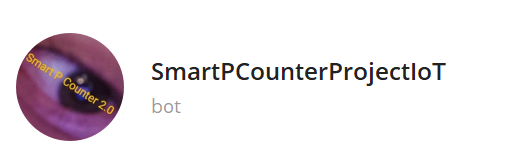
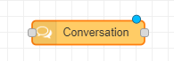
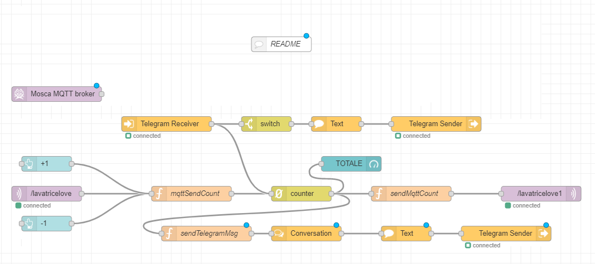

# Smart P. Counter 2.0
Conta le persone in entrata grazie all'utilizzo di un sensore ultrasonico piazzato al lato di una porta.
Ogni volta che il sensore viene attraversato viene inviato un "1" via mqtt a node red che si occuperà di aggiornare il contatore. 
I dati totali del conteggio sono visualizzati all'interno di una dashboard e inoltre vengono inviati via mqtt a uno schermo OLED collegato ad Arduino.  
Il sistema si integra anche con un bot telegram che manda dei messaggi all'avvicinarsi della capienza massima consentita, in modo tale che chi si occupa della sicurezza
può intervenire sul posto.   

_Il bot si chiama SmartPCounterProjectIoT_  
 

## Configurazione:
Per far funzionare il tutto bisogna eseguire la seguente configurazione:
 * Avviare il bot _SmartPCounterProjectIoT_
 * Inviare il comando /chatid al bot
 * Il bot restituirà il tuo chatId
 * Aprire Node-Red
 * Aprire il nodo Conversation
 * Riempiere il campo _chatId_ con il proprio chatId
 * Ecco ora il bot è Funzionante!
 
 _Nodo conversation_  
  
 _Campo da modificare_  
  

## Nodi utilizzati
 - node-red-contrib-chatbot
 - node-red-contrib-counter 
 - node-red-contrib-mqtt-broker
 - node-red-dashboard
 
## Librerie Arduino Utilizzate
 * Grove Ultrasonic Ranger per la gestione del sensore ultrasonico
 * u8g2 per la gestione dello schermo OLED
 * WiFiNINA per la gestione dell'antena WiFi

### Note Finali
ho scelto 100cm come valore standard della larghezza di una porta ma ovviamente può essere modificato

Sono consapevole del fatto che l'applicativo conta solo persone in entrata ma in mancanza di un secondo sensore ultrasonico non ho potuto implementare anche il conteggio dell'uscita, cosa comunque semplice da fare!

## IL FLOW DEL PROGETTO
 

_last update 09/10/2020_

